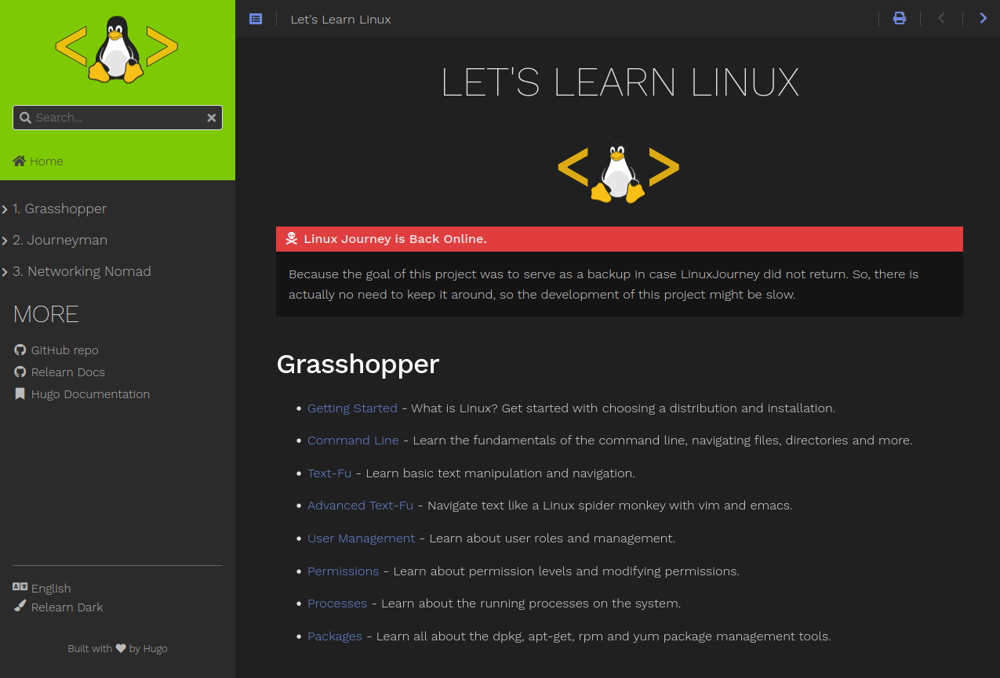

<H1 align="center">Let's Learn Linux</H1>

> **Note**
> This Project needs contributors to pull content from Linux Journey to Let's Learn Linux. Only basic knowledge of HTML, Markdown and Hugo is needed for contribution. please help us out if you can.

#### Note: The Linux Journey site is now online again, so development of this project might be slow.
### To clone Use following Method 

#### 1. By Git Submodule init and Update method 
- `git clone <url of repo>`
- `git submodule init`
- `git submodule update`

> **Warning**
> If you get any SSH error while cloning submodule, change the submodule link in .gitmodules file to https one from SSH one like this:

`url = git@github.com:Prakash4844/hugo-theme-relearn.git` to `url = https://github.com/Prakash4844/hugo-theme-relearn.git`

#### 2. Git Submodule init and update alternative

Git recursive clone with submodules `git clone --recurse-submodules <url of repo>`

> **Warning**
> If you get any SSH error while cloning submodule, change the submodule link in .gitmodules file to https one from SSH one like this:

`url = git@github.com:Prakash4844/hugo-theme-relearn.git` to `url = https://github.com/Prakash4844/hugo-theme-relearn.git`

## Website is Currently Live at [Let's Learn Linux](https://prakash4844.github.io/Let-s-Learn-Linux/) 

## Contriubution:
- For info on How to contribute See this [CONTRIBUTING.md](https://github.com/Prakash4844/Let-s-Learn-Linux/tree/main/Contribute/Contributing)
- For a list of Contributors See this [Contributors.md](https://github.com/Prakash4844/Let-s-Learn-Linux/tree/main/Contribute/Contributors)

## Resources:
- Content is forked from [LinuxJourney](https://github.com/cindyq/linuxjourney)
- Website Uses Hugo version 0.110.0, [Check it out](https://gohugo.io/)
- And Hugo Relearn Theme, [Check it out](https://github.com/McShelby/hugo-theme-relearn)
- Font Linux [Check it out](https://github.com/lkundrak/font-linux)
- Hugo QuizDown [Check it out](https://github.com/bonartm/hugo-quiz)
