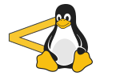

+++
archetype = "home"
title = "Let's Learn Linux"
+++

{}
Because the goal of this project was to serve as a backup in case LinuxJourney did not return. So, there is actually no need to keep it around, so the development of this project might be slow.
{}

## [Grasshopper](  )

* [Getting Started](  ) - What is Linux? Get started with choosing a distribution and installation.

* [Command Line](  ) - Learn the fundamentals of the command line, navigating files, directories and more.

* [Text-Fu](  ) - Learn basic text manipulation and navigation.

* [Advanced Text-Fu](  ) - Navigate text like a Linux spider monkey with vim and emacs.

* [User Management](  ) - Learn about user roles and management.

* [Permissions](  ) - Learn about permission levels and modifying permissions.

* [Processes](  ) - Learn about the running processes on the system.

* [Packages](  ) - Learn all about the dpkg, apt-get, rpm and yum package management tools.

## [Journeyman](  )

* [Devices](  ) - Learn about Linux devices and how they interact with the kernel and user space.

* [The Filesystem](  ) - Learn about the Linux filesystem, the different types of filesystems, partitioning and more.

* [Boot the System](  )  - Learn about the stages of the Linux boot process.

* [Kernel](  )  - The most important part of the Linux system, learn about how it works and how to configure it.

* [Init](  )  - Learn about the different init systems, SysV, Upstart and systemd.

* [Process Utilization](  ) - Learn resource monitoring with top, load averages, iostat and more!

* [Logging](  ) - Learn about system logs and the /var/log directory.

## [Networking Nomad](  )

* [Network Sharing](  ) - Learn about network sharing with rsync, scp, nfs and more.

* [Network Basics](  ) - Learn about networking basics and the TCP/IP model.

* [Subnetting](  ) - Learn about subnets and how to do subnet arithmetic!

* [Routing](  ) - Learn how packets are routed across networks!

* Network Config - Learn about network configuration using Linux tools!

* Troubleshooting - Learn about common networking tools to help you diagnose and troubleshoot issues!

* DNS - Everything and more that you wanted to know about DNS.

